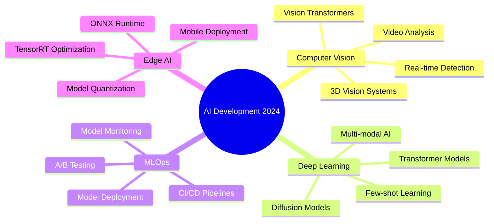

<div align="center">

# 👋 Hi, I'm Guna Teja Sarvan Patnaik

### 🤖 AI Engineer | 👁️ Computer Vision Specialist | 🚀 Open Source Enthusiast


[](https://www.linkedin.com/in/guna-teja-sarvan-patnaik/)
[](mailto:tejag078@gmail.com)
[](https://x.com/gunateja10008)
[](https://tejafolio.dev/)
[](https://stackoverflow.com/users/26361145/teja/)

</div>

---

## 🚀 About Me

```python
class AIEngineer:
    def __init__(self):
        self.name = "Guna Teja Sarvan Patnaik"
        self.role = "AI Developer & CV Specialist"
        self.location = "🇮🇳 India"
        self.motto = "Building intelligent systems, one neural net at a time"
        
        self.languages = ["Python", "C++", "TypeScript", "Java", "Dart", "R"]
        
        self.expertise = {
            "ai_ml": [
                "Deep Learning",
                "Computer Vision", 
                "Neural Networks",
                "Transfer Learning"
            ],
            "cv_tasks": [
                "Object Detection (YOLO v5-v11)",
                "Image Segmentation (U-Net, Mask R-CNN)",
                "OCR & Document Processing",
                "Face Recognition & Verification"
            ],
            "frameworks": [
                "PyTorch", "TensorFlow", "OpenCV",
                "YOLO", "FastAPI", "Scikit-learn"
            ],
            "deployment": [
                "Docker", "AWS", "TensorRT",
                "ONNX", "Edge AI"
            ]
        }
    
    def daily_routine(self):
        return {
            "morning": "☕ Coffee + Latest Papers",
            "afternoon": "💻 Training Models & Experiments", 
            "evening": "🐛 Debugging & Optimization",
            "night": "🚀 Open Source Contributions"
        }
    
    def current_focus(self):
        return [
            "🔬 Advanced Vision Transformers",
            "⚡ Model Optimization & TensorRT",
            "🌐 MLOps & Production Deployment",
            "📊 3D Computer Vision"
        ]

me = AIEngineer()
print("👋 Let's build something amazing together!")
```

---

## 💻 Tech Stack

<div align="center">

### 🎯 Languages & Core


### 🧠 AI/ML & Deep Learning


### 🛠️ Development & Tools


### ☁️ Cloud & Database


</div>

---

## 🎯 Specializations

<table>
<tr>
<td width="50%">

### 👁️ Computer Vision
- **Object Detection**
  - YOLO (v5, v7, v8, v11)
  - Faster R-CNN, RetinaNet
  - EfficientDet, SSD
- **Segmentation**
  - U-Net, DeepLab
  - Mask R-CNN
  - Semantic & Instance
- **Recognition**
  - Face Recognition (FaceNet)
  - OCR (Tesseract, EasyOCR)
  - Image Classification

</td>
<td width="50%">

### 🚀 ML Engineering
- **Model Development**
  - Neural Architecture Design
  - Transfer Learning
  - Custom Loss Functions
  - Data Augmentation Pipelines
- **Optimization**
  - Model Quantization
  - Pruning & Compression
  - TensorRT Acceleration
  - ONNX Conversion
- **Deployment**
  - REST APIs (FastAPI)
  - Edge Deployment
  - Cloud Integration (AWS)
  - CI/CD for ML

</td>
</tr>
</table>

---

## 📊 GitHub Analytics

<div align="center">
  


</div>

---

## 🏆 Achievements & Milestones

<div align="center">

| 🎯 Metric | 📊 Status | 🎖️ Achievement |
|:---:|:---:|:---:|
| **AI Models** | 🚀 Production Ready | Successfully Deployed |
| **CV Projects** | 💡 Advanced Level | Object Detection & Segmentation |
| **Open Source** | ⭐ Active Contributor | Regular Commits |
| **Code Quality** | ✨ High Standards | Clean & Documented |

[](https://github.com/ryo-ma/github-profile-trophy)

</div>

---

## 💡 Current Focus & Learning Path



---

## 📈 Contribution Activity

<div align="center">


</div>

---

## 💭 Daily Inspiration

<div align="center">


</div>

---

## 🌟 Featured Projects

<div align="center">

[](https://github.com/GunaTeja777)

*Replace YOUR_REPO_NAME with your actual repository names*

</div>

---

<div align="center">

## 🤝 Let's Connect & Collaborate

**I'm always excited to discuss AI, collaborate on innovative projects, or just chat about technology!**

### 💬 Open for:
✅ AI/ML Collaborations | ✅ Open Source Projects | ✅ Consulting & Freelance | ✅ Speaking Opportunities

<br>

### 📫 Reach Out:
[](https://www.linkedin.com/in/guna-teja-sarvan-patnaik/)
[](mailto:tejag078@gmail.com)
[](https://tejafolio.dev/)

<br>


---


### ⚡ Fun Fact
*"I debug neural networks faster than I debug my own life decisions"* 😄

**💙 Crafted with passion by [Guna Teja](https://github.com/GunaTeja777)**

*Last Updated: December 2024*

</div>
