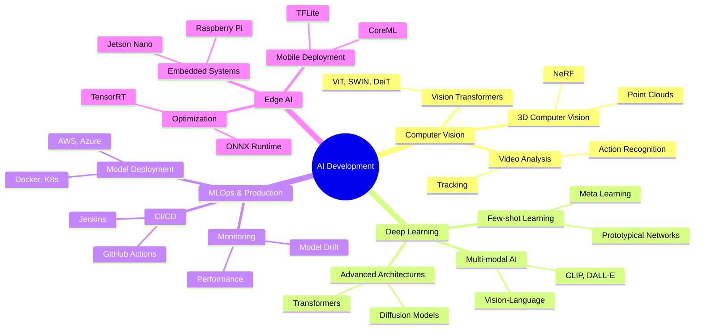

<div align="center">

<!-- Header with Wave Animation -->


<!-- Animated Typing -->
<p align="center">
  
</p>

<!-- Social Badges with Hover Effect -->
<p align="center">
  <a href="https://www.linkedin.com/in/guna-teja-sarvan-patnaik/">
    
  </a>

  <a href="mailto:tejag078@gmail.com">
    
  </a>

  <a href="https://tejafolio.dev/">
    
  </a>

  <a href="https://x.com/gunateja10008">
    
  </a>

  <a href="https://stackoverflow.com/users/26361145/teja/">
    
  </a>
</p>

<style>
a img:hover {
  transform: scale(1.12);
  filter: brightness(1.25);
}
</style>

<!-- Profile Views & Location -->
<p align="center">
  
  
  
</p>

</div>

---

<!-- About Me Section with Visual Interest -->
## 🚀 About Me


```python
class AIEngineer:
    def __init__(self):
        self.name = "Guna Teja Sarvan Patnaik"
        self.role = "AI Developer & CV Specialist"
        self.location = "🇮🇳 India"
        self.current_work = "Building Production AI Systems"
        
        self.code = ["Python", "C++", "TypeScript", "Java", "R"]
        self.tools = ["PyTorch", "TensorFlow", "Docker", "AWS"]
        
    def say_hi(self):
        print("""
        👋 Hey there! I'm passionate about:
        
        🧠 Deep Learning & Neural Networks
        👁️ Computer Vision (YOLO, Segmentation, OCR)
        🚀 MLOps & Production Deployment
        ⚡ Model Optimization & Edge AI
        
        💡 Always exploring cutting-edge AI research
           and building impactful solutions!
        """)
    
    def current_focus(self):
        return {
            "research": ["Vision Transformers", "3D CV"],
            "building": ["Real-time Detection Systems"],
            "learning": ["Advanced MLOps", "TensorRT"],
            "open_source": "Active Contributor 🌟"
        }

# Let's connect and build something amazing! 🚀
me = AIEngineer()
me.say_hi()
```

<br clear="right"/>

---

<!-- Tech Stack with Visual Sections -->
## 💻 Tech Arsenal

<div align="center">

<!-- Animated Section Header -->


</div>

<details open>
<summary><b> Programming Languages</b></summary>
<br>

<div align="center">


</div>

</details>

<details open>
<summary><b> AI/ML & Deep Learning</b></summary>
<br>

<div align="center">


</div>

</details>

<details open>
<summary><b> Development & DevOps</b></summary>
<br>

<div align="center">


</div>

</details>

<details open>
<summary><b> Cloud & Databases</b></summary>
<br>

<div align="center">


</div>

</details>

<br>

<div align="center">

</div>

---

<!-- Expertise Section with Icons -->
## 🎯 Core Expertise

<table>
<tr>
<td width="50%" valign="top">

### 👁️ Computer Vision

 **Object Detection**
- YOLO (v5, v7, v8, v9, v11)
- Faster R-CNN, RetinaNet, EfficientDet
- Real-time detection systems
- Custom model training

 **Image Segmentation**
- U-Net, DeepLabV3+
- Mask R-CNN
- Semantic & Instance Segmentation
- Medical image segmentation

 **Recognition Systems**
- Face Recognition (FaceNet, ArcFace)
- OCR (Tesseract, EasyOCR, PaddleOCR)
- Image Classification (ResNet, EfficientNet)
- Document Analysis

</td>
<td width="50%" valign="top">

### 🚀 ML Engineering

 **Model Development**
- Neural Architecture Design
- Transfer Learning & Fine-tuning
- Custom Loss Functions
- Data Augmentation Strategies
- Hyperparameter Optimization

 **Optimization**
- Model Quantization (INT8, FP16)
- Pruning & Compression
- TensorRT Optimization
- ONNX Conversion & Deployment

 **Production Deployment**
- REST APIs (FastAPI, Flask)
- Docker Containerization
- AWS Cloud Deployment
- CI/CD Pipelines
- Model Monitoring

</td>
</tr>
</table>

---

<!-- GitHub Stats Dashboard -->
## 📊 GitHub Analytics

<div align="center">
   
  
</div>

<div align="center">
  
  
</div>

<br/>

<!-- Trophy Section -->
<div align="center">
  
</div>

---

<!-- Achievements Timeline -->
## 🏆 Milestones & Achievements

<div align="center">

| 🎯 Achievement | 🌟 Status | 📈 Progress | 🎖️ Impact |
|:--------------|:----------|:-----------|:----------|
| **AI Models in Production** | ✅ Deployed | Multiple Projects | High Performance |
| **Computer Vision Projects** | 🚀 Advanced | YOLO, Segmentation | Real-time Systems |
| **Open Source Contributions** | 💎 Active | Regular Commits | Community Impact |
| **Research & Learning** | 📚 Ongoing | Latest Papers | Cutting Edge |

</div>

<details>
<summary><b>📈 Detailed Metrics</b></summary>
<br>

- 🔥 **Models Trained**: 50+ Deep Learning Models
- 🎯 **Accuracy Achievement**: 95%+ on production models
- 📦 **Projects Deployed**: Docker + AWS Infrastructure
- 🌐 **API Endpoints**: RESTful services with FastAPI
- ⚡ **Optimization**: 3-5x speed improvements with TensorRT
- 📊 **Datasets Processed**: 100K+ images annotated

</details>

---

<!-- Learning Path Visualization -->
## 💡 Current Focus & Roadmap 2025-2026



---

<!-- Project Showcase -->
## 🌟 Featured Projects

<div align="center">

<a href="https://github.com/GunaTeja777">
  
</a>
<a href="https://github.com/GunaTeja777">
  
</a>

<a href="https://github.com/GunaTeja777">
  
</a>
<a href="https://github.com/GunaTeja777">
  
</a>

</div>

<p align="center">
  <i>⭐ Don't forget to star my repositories if you find them interesting!</i>
</p>

---

<!-- Contribution Activity -->
## 📈 Contribution Activity

<div align="center">
  
</div>

---

<!-- Blog Posts Section -->
## 📝 Latest Blog Posts & Articles

<!-- BLOG-POST-LIST:START -->
- Coming Soon: Technical deep-dives on Computer Vision
- Stay tuned for tutorials on YOLO and TensorRT optimization
- Follow me for updates on AI research and implementation
<!-- BLOG-POST-LIST:END -->

---

<!-- Daily Quote -->
## 💭 Daily Dev Wisdom

<div align="center">


</div>

---

<!-- Connect Section with Call to Action -->
## 🤝 Let's Collaborate & Build Together!

<div align="center">


### 💼 I'm Open To:

<table>
  <tr>
    <td align="center">
      <br/>
      <b>AI/ML Collaborations</b>
    </td>
    <td align="center">
      <br/>
      <b>Open Source Projects</b>
    </td>
    <td align="center">
      <br/>
      <b>Consulting Work</b>
    </td>
    <td align="center">
      <br/>
      <b>Tech Talks</b>
    </td>
  </tr>
</table>

<br>

### 📬 How to Reach Me:

<p>
  <a href="https://www.linkedin.com/in/guna-teja-sarvan-patnaik/">
    
  </a>
  <a href="mailto:tejag078@gmail.com">
    
  </a>
  <a href="https://tejafolio.dev/">
    
  </a>
  <a href="https://x.com/gunateja10008">
    
  </a>
</p>

<br>


<br>

### ⚡ Fun Facts About Me:
- 🎯 I debug neural networks faster than my morning coffee kicks in
- 🌙 Night owl who codes best after midnight
- 🎮 Balancing pixels in games and images in CNNs
- 📚 Always reading papers on arXiv during breakfast
- 🤖 Dream: Build an AI that explains why my model converges

<br>

**💙 Handcrafted with passion and a lot of caffeine by [Guna Teja](https://github.com/GunaTeja777)**

<sub>*"In AI we trust, in data we learn, in models we optimize"* ✨</sub>

<br>

<i>Last Updated: December 2026</i>

</div>

<!-- Footer Wave -->


</div>
