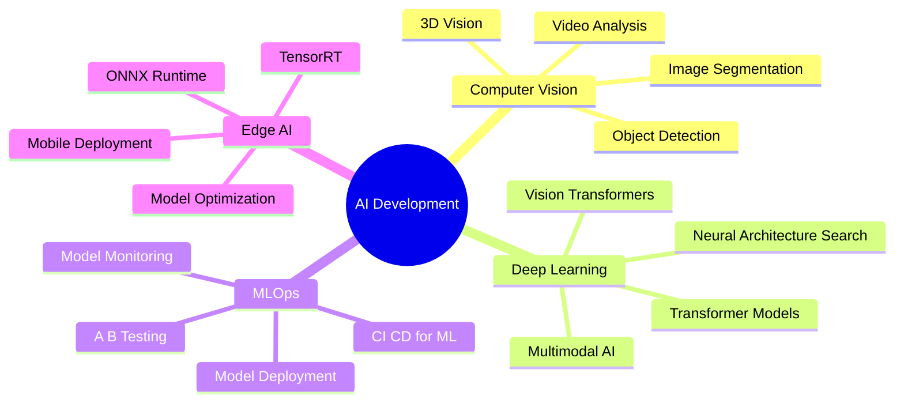

<div align="center">

<!-- Animated Header -->


</div>

<br/>

<div align="center">

<!-- Typing Animation -->


<br/><br/>

<!-- Profile Views & Social Badges -->
<p>
  
  
</p>

</div>

---

## 🚀 About Me

<table>
<tr>
<td width="60%" valign="top">

```python
class AIEngineer:
    def __init__(self):
        self.name = "Guna Teja Sarvan Patnaik"
        self.role = "AI Developer & CV Specialist"
        self.location = "🇮🇳 India"
        self.languages = [
            "Python", "C++", "TypeScript", 
            "Java", "Dart", "R"
        ]
        self.expertise = {
            "ai_ml": [
                "Deep Learning", 
                "Computer Vision", 
                "Neural Networks"
            ],
            "cv_tasks": [
                "Object Detection", 
                "Image Segmentation", 
                "OCR"
            ],
            "frameworks": [
                "PyTorch", "TensorFlow", 
                "OpenCV", "YOLO"
            ],
            "deployment": [
                "Docker", "AWS", 
                "FastAPI", "TensorRT"
            ]
        }
        
    def daily_routine(self):
        return {
            "morning": "☕ Coffee + Research",
            "afternoon": "💻 Building Models",
            "evening": "🐛 Debugging NNs",
            "night": "🚀 Open Source"
        }
    
    def say_hi(self):
        print("👋 Let's innovate together!")

me = AIEngineer()
me.say_hi()
```

</td>
<td width="40%" valign="top">


</td>
</tr>
</table>

---

## 🌐 Connect & Collaborate

<div align="center">

[](https://www.linkedin.com/in/guna-teja-sarvan-patnaik/)
[](mailto:tejag078@gmail.com)
[](https://x.com/home)
[](https://stackoverflow.com/users/26361145/teja/)
[](https://github.com/GunaTeja777)

</div>

---

## 💻 Tech Stack & Expertise

<div align="center">

### 🎯 Core Technologies

<table>
<tr>
<td align="center" width="96">

<br><strong>Python</strong>
</td>
<td align="center" width="96">

<br><strong>C++</strong>
</td>
<td align="center" width="96">

<br><strong>TypeScript</strong>
</td>
<td align="center" width="96">

<br><strong>Java</strong>
</td>
<td align="center" width="96">

<br><strong>Docker</strong>
</td>
<td align="center" width="96">

<br><strong>AWS</strong>
</td>
</tr>
</table>

<br/>

### 🧠 AI/ML & Deep Learning

<p align="center">


<br/>


</p>

<br/>

### 👁️ Computer Vision Arsenal

<p align="center">


<br/>


</p>

<br/>

### 🛠️ Development & Deployment

<p align="center">


<br/>


</p>

<br/>

### ☁️ Cloud & Database

<p align="center">


<br/>


</p>

</div>

---

## 🎯 Specializations & Expertise

<div align="center">

<table>
<tr>
<td width="50%" valign="top">

### 🔬 Computer Vision

- **Object Detection**
  - YOLO (v5-v11)
  - Faster R-CNN, SSD
  - RetinaNet, EfficientDet

- **Image Segmentation**
  - U-Net, DeepLab
  - Mask R-CNN
  - Semantic/Instance Segmentation

- **Recognition Systems**
  - Face Recognition (FaceNet, ArcFace)
  - OCR (Tesseract, EasyOCR)
  - Image Classification

</td>
<td width="50%" valign="top">

### 🚀 ML Engineering

- **Model Development**
  - Neural Architecture Design
  - Transfer Learning
  - Custom Loss Functions
  - Data Augmentation

- **Optimization**
  - Model Quantization
  - Pruning & Compression
  - TensorRT Optimization
  - ONNX Conversion

- **Deployment**
  - REST APIs (FastAPI, Flask)
  - Edge Deployment
  - Cloud Integration

</td>
</tr>
</table>

</div>

---

## 📊 GitHub Statistics

<div align="center">

<a href="https://github.com/GunaTeja777">
  
</a>
<a href="https://github.com/GunaTeja777">
  
</a>

</div>

<div align="center">

<a href="https://github.com/GunaTeja777">
  
</a>
<a href="https://github.com/GunaTeja777">
  
</a>

</div>

---

## 🏆 GitHub Achievements

<div align="center">
  
</div>

---

## 🎨 Contribution Graph

<div align="center">

<picture>
  <source media="(prefers-color-scheme: dark)" srcset="https://raw.githubusercontent.com/platane/platane/output/github-contribution-grid-snake-dark.svg">
  <source media="(prefers-color-scheme: light)" srcset="https://raw.githubusercontent.com/platane/platane/output/github-contribution-grid-snake.svg">
  
</picture>

</div>

---

## 💡 Current Focus & Learning

<div align="center">



</div>

---

## 🏆 Achievements & Milestones

<div align="center">

| 🎯 Focus Area | 🔥 Current Status | 🚀 Next Goal |
|:---:|:---:|:---:|
| **AI Models Deployed** | Production Ready | Edge AI Optimization |
| **Computer Vision Projects** | Advanced Implementations | 3D Vision Systems |
| **Open Source** | Active Contributor | Maintainer Role |
| **Research** | Paper Reading | Publication |

</div>

---

## 📈 Detailed Activity

<div align="center">


</div>

---

## 💭 Random Dev Quote

<div align="center">


</div>

---

<div align="center">

### 📫 Let's Build Something Amazing Together!


<br/>

**💙 Made with passion by [Guna Teja](https://github.com/GunaTeja777)**
