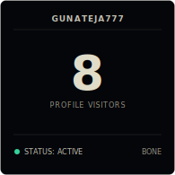
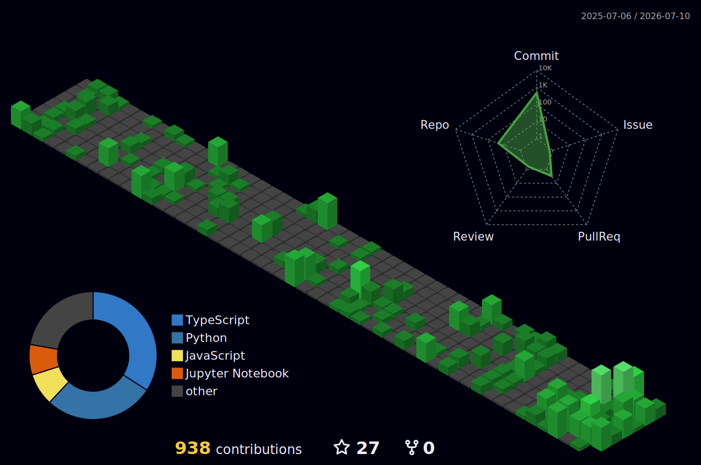

### What's Up?

I’m **Guna Teja**, currently building intelligent AI systems and open-source machine learning applications. Cheers!

[][github-profile]
&nbsp;
[][github-profile]

 

### 3D Contributions

### Let's Connect

[][gmail]&emsp;
[][linkedin]&emsp;
[][instagram]&emsp;
[][x]

<!-- REFERENCE LINKS -->

[github-profile]: https://github.com/GunaTeja777

[gmail]: mailto:gunatejawork@gmail.com
[linkedin]: https://www.linkedin.com/in/guna-teja-sarvan-patnaik/
[x]: https://x.com/gunateja10008
[instagram]: https://www.instagram.com
