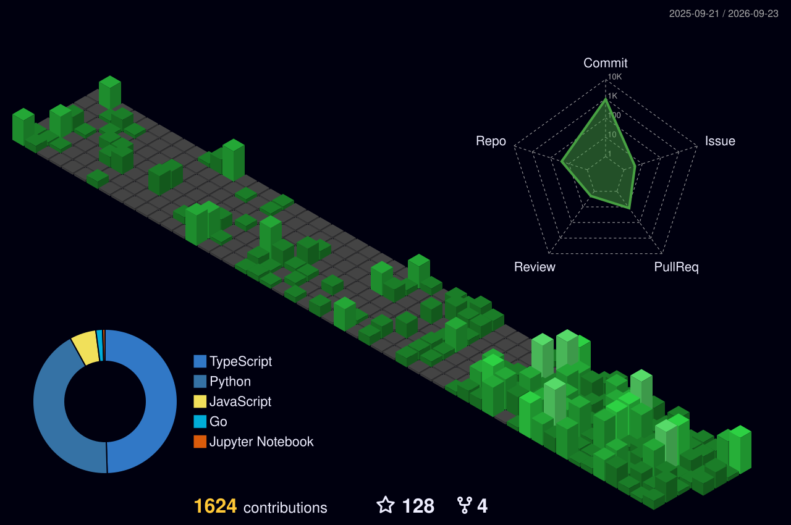

### What's Up?

I’m **Guna Teja**, currently building intelligent AI systems and open-source machine learning applications. Cheers!

<h3>⚡ Tech Stack</h3>

  
  
  
  
  
  

[][github-profile]

 

### 3D Contributions

### Let's Connect

[][gmail] 
[][linkedin] 
[][instagram] 
[][x]

<!-- REFERENCE LINKS  -->

[github-profile]: https://github.com/GunaTeja777
[gmail]: mailto:gunatejawork@gmail.com
[linkedin]: https://www.linkedin.com/in/guna-teja-sarvan-patnaik/
[x]: https://x.com/gunateja10008
[instagram]: https://www.instagram.com/gunateja777?utm_source=qr&igsh=MTd4M2VmNWh4cDR1Yg==
